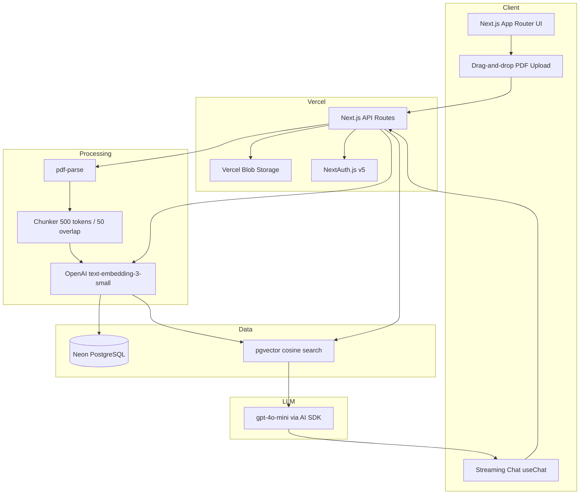

# DocuMind — RAG Document Q&A

Production-ready retrieval-augmented generation (RAG) application built with Next.js 14, OpenAI, pgvector on Neon PostgreSQL, and Vercel Blob.

Upload PDFs, embed them into a vector database, and ask questions with streaming answers and page-level source citations.

## Architecture



### RAG pipeline

1. **Upload** — PDF stored in Vercel Blob (max 20MB).
2. **Parse** — `pdf-parse` extracts text per page.
3. **Chunk** — Split by paragraph, then by token budget (500 max, 50-token overlap between chunks).
4. **Embed** — Each chunk embedded with `text-embedding-3-small` (1536 dimensions).
5. **Store** — Chunks + vectors saved in PostgreSQL via pgvector.
6. **Query** — User question embedded → cosine similarity retrieves top 5 chunks.
7. **Guard** — If best similarity &lt; 0.75, respond with *"I couldn't find relevant information in this document."*
8. **Answer** — Relevant chunks + question sent to `gpt-4o-mini`; response streamed to UI with page citations.

## Tech stack

| Layer | Technology |
|-------|------------|
| Frontend | Next.js 14 App Router, React, Tailwind CSS, shadcn/ui |
| Backend | Next.js API routes |
| Auth | NextAuth.js v5 (credentials) |
| ORM | Prisma 7 |
| Database | Neon PostgreSQL + pgvector |
| Storage | Vercel Blob |
| AI | Vercel AI SDK, OpenAI embeddings + gpt-4o-mini |
| PDF | pdf-parse |

## Getting started

### Prerequisites

- Node.js 20+
- Neon PostgreSQL database with **pgvector** enabled
- OpenAI API key
- Vercel Blob store token

### 1. Clone and install

```bash
npm install
```

### 2. Configure environment

```bash
cp .env.example .env
```

Fill in all variables (see `.env.example` for descriptions).

**Neon pgvector:** In the Neon SQL editor, run:

```sql
CREATE EXTENSION IF NOT EXISTS vector;
```

### 3. Run migrations

```bash
npm run db:migrate
```

Or push schema directly during development:

```bash
npm run db:push
```

### 4. Start dev server

```bash
npm run dev
```

Open [http://localhost:3000](http://localhost:3000), register, upload a PDF, and start chatting once processing completes.

## Deploy to Vercel

1. Push the repo to GitHub and import into Vercel.
2. Add environment variables from `.env.example`.
3. Create a Vercel Blob store and link `BLOB_READ_WRITE_TOKEN`.
4. Connect a Neon Postgres integration (enable pgvector).
5. Run migrations against production:

   ```bash
   npx prisma migrate deploy
   ```

## API routes

| Route | Method | Description |
|-------|--------|-------------|
| `/api/auth/register` | POST | Create account |
| `/api/documents` | GET/POST | List / upload documents |
| `/api/documents/[id]` | GET/DELETE | Document detail / delete |
| `/api/documents/[id]/status` | GET | Processing progress |
| `/api/documents/[id]/process` | POST | Parse, chunk, embed PDF |
| `/api/documents/[id]/sessions` | GET/POST | Chat sessions |
| `/api/chat` | POST | Streaming Q&A |

## Database models

- **User** — Auth + ownership
- **Document** — PDF metadata, status, processing progress
- **Chunk** — Text segment + pgvector embedding
- **ChatSession** — Per-document conversations
- **ChatMessage** — User/assistant messages with citation JSON

## Error handling

- Oversized files (&gt;20MB) rejected at upload
- Corrupt/unreadable PDFs marked `FAILED` with error message
- OpenAI rate limits surfaced to the user
- Low-confidence answers blocked by similarity threshold (0.75)

## Scripts

```bash
npm run dev          # Development server
npm run build        # Production build
npm run db:generate  # Generate Prisma client
npm run db:migrate   # Apply migrations (dev)
npm run db:push      # Push schema without migration files
```

## License

MIT
